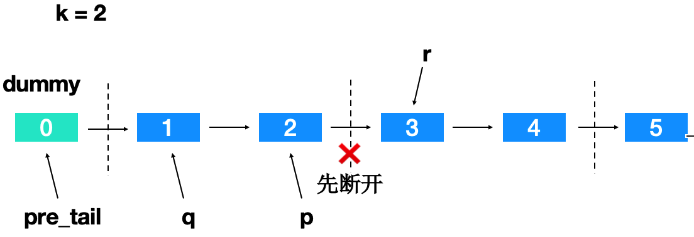
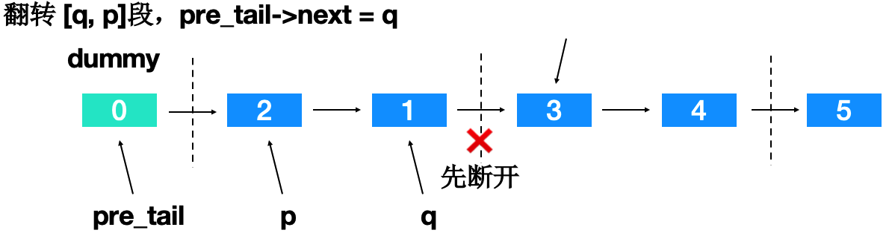

给你链表的头节点 head ，每 k 个节点一组进行翻转，请你返回修改后的链表。  
k 是一个正整数，它的值小于或等于链表的长度。  
如果节点总数不是 k的整数倍，那么请将最后剩余的节点保持原有顺序。  
你不能只是单纯的改变节点内部的值，而是需要实际进行节点交换。  

Solution：分组 + 链表就地逆置 + 指针处理。  
1 -> 2 -> 3 -> 4 -> 5, k = 2。  
从前往后，分组翻转，过程中链接。  
细节如图。  



在编码实现时，要注意以下细节处理：  
1. p指针的判空。
2. 处理过程中指针的更新。
3. 最后一组如果长度不满 k，保持原有顺序。
```C++
#include "header.h"
class Solution {
public:
    // 链表就地逆置，返回逆置后的链表头
    // head是逆置后的链表尾部
    // 传引用就地修改
    void reverse(ListNode*& head) { 
        ListNode *pre = nullptr, *cur = head, *nxt;
        while (cur) {
            nxt = cur->next;
            cur->next = pre;
            pre = cur;
            cur = nxt;
        }
    }

    ListNode* reverseKGroup(ListNode* head, int k) {
        ListNode *p = head, *q, *r;
        ListNode *dummy = new ListNode(0), *pre_tail = dummy;
        int i;
        while (p) {
            q = p;
            for (i = 0; i < k - 1 && p->next; ++i) {
                p = p->next;
            }
            // 最后剩余的结点需要保持原有顺序
            if (i < k - 1) {
                pre_tail->next = q;
                break;
            }
            r = p->next;
            p->next = nullptr; // 断开 [q, p]段便于翻转
            reverse(q); // 翻转 [q, p]段
            pre_tail->next = p;
            pre_tail = q;
            p = r;
        }
        return dummy->next;
    }
};

```
