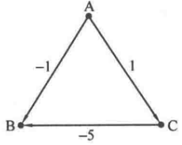
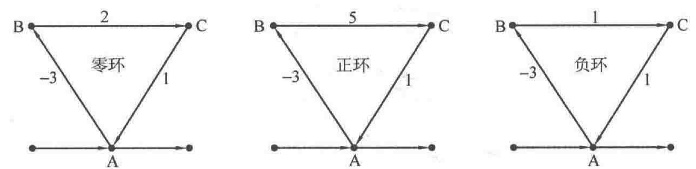

最短路问题，从类型上分可以分为单源最短路和多源最短路问题。

# 单源最短路问题（SSSP）
即从单个源点出发，到所有结点的最短路。

## Dijkstra算法
Dijkstra算法适合 **边权为正** 的情况。  

### 基本思想
对图 $G(V, E)$，$V$为点集，$E$为边集，设置集合 $S$，存放已被访问的顶点。  
每次从集合 $V - S$ 中选择与起点 $s$ 的最短距离最小的一个顶点（记为 $u$），访问并加入集合 $S$。  
之后，令顶点 $u$ 作为中介点，优化起点 $s$ 与**所有**从 $u$ 能到达的顶点 $v$ 之间的最短距离。
这样的操作执行 $n$ 次，直到集合 $S$ 已包含所有顶点。

### 基本版
> 算法流程  
> 1. 初始化访问数组
> 2. 假设源点为 0，d数组记录源点到每个点的最短距离。d[0] = 0, d[i] = INF  
> 3. 循环 n 次 {  
>       在所有未标记的结点中，选出 d值最小的结点 u  
>       给结点 u 做标记  
>       对于从 u 出发的所有边 (u, v)，更新 d[v] = min(d[v], d[u] + w(u, v))  
>    } 

时间复杂度：$O(n^2)$，空间复杂度：$O(n)$

```cpp
void dijkstra(int s) {
    memset(vis, 0, sizeof(vis));
    for (int i = 0; i < n; ++i) {
        d[i] = INF;
    }
    d[s] = 0;
    for (int i = 0; i < n; ++i) {
        int u = -1, MIN = INF;
        for (int j = 0; j < n; ++j) {
            if (!vis[j] && d[j] < MIN) {
                u = j;
                MIN = d[j];
            }
        }
        // 找不到小于 INF的 d[u]，说明剩下的顶点和起点 s 不连通
        if (u == -1) return;
        vis[u] = true; // 标记 u为已访问

        // 邻接矩阵伪代码，如果 v能到达 u。
        for (int v = 0; v < n; ++v) {
            if (!vis[v] && G[u][v] != INF && d[u] + G[u][v] < d[v]) {
                d[v] = d[u] + G[u][v];
                // 可以采用一个father数组轻松记录起点 0到结点u的最短路径
                // father中记录上一个结点，打印时可以从终点出发开始回退。
                // father[v] = u; 
            }
        }

        // // 邻接表伪代码
        // for (int j = 0; j < adj[u].size(); ++j) {
        //     int v = adj[u][j].v;
        //     if (!vis[v] && d[u] + adj[u][j].dis < d[v]) {
        //         d[v] = d[u] + adj[u][j].dis;
        //         // 可以采用一个father数组轻松记录起点 0到结点u的最短路径
        //         // father中记录上一个结点，打印时可以从终点出发开始回退。
        //         // father[v] = u; 
        //     }
        // }
    }
}

```
### 优先级队列优化版
时间复杂度：$O(ElogV)$，空间复杂度：$O(V)$，其中 $m$ 为边数。   

针对 **在所有未标记的结点中，选出 d值最小的结点 u** 该操作，可以使用优先级队列进行优化。  

优先级队列中存储 d[i]和 编号 i的对应关系，第一维为 d，先自动排序第一维，再排第二维。

退出条件为队列为空。

```cpp
void dijkstra(int s) {
    memset(vis, 0, sizeof(vis));
    for (int i = 0; i < n; ++i) {
        d[i] = INF;
    }
    d[s] = 0;
    using pii = pair<int, int>;
    priority_queue<pii, vector<pii>, greater<pii>> pq;
    pq.push({0, s});
    while (!pq.empty()) {
        pii x = pq.top();
        pq.pop();
        int u = x.first;
        if (vis[u]) { // 该结点已访问过
            continue;
        }
        vis[u] = true;
        for (int j = 0; j < adj[u].size(); ++j) {
            int v = adj[u][j].v;
            if (d[u] + adj[u][v].dis < d[v]) {
                d[v] = d[u] + adj[u][v].dis;
                pq.push({d[v], v}); // 能访问到的结点入队
                // father[v] = u;
            }
        }
    }
}
```


一般来说，使用优先级队列实现的 Dijkstra 算法比基本法的 Dijkstra算法快得多。


## Bellman-Ford算法
Dijkstra算法可以很好地解决无负权图的最短路径问题，但如果出现了负权边，算法就会失效。  
如下图，为一个有向图。  

  

> 若 A 为源点，会先将 d[B] = -1, d[C] = 1。  
> 接着由于 d[B] 最小，用 B去更新未访问的邻接点，然后标记 B为已访问。  
> 接着从 C出发，但是此时不能通过 C出发进行边 CB的更新。  
> 因此最后 d[B] = -1。  
> 而正确答案应该是 A -> C -> B，d[B] = -4。

求解带负权边的**单源**最短路问题，可以使用 **Bellman-Ford算法**。

与 Dijkstra算法不同，Bellman-Ford算法是对边进行遍历。  
一个实现很好的 Dijkstra算法比 Bellman-Ford算法要快。

> 算法流程  
> 对图中的边进行 $V - 1$ 轮操作，每轮都遍历图中的所有边。  
> 对于每条边 $u \rightarrow v$，如果以 $u$为中介点可以使得 d[v]更小。  
> 那么就用 d[u] + length[u->v] 更新 d[c]（松弛操作）。  
> 时间复杂度：$O(VE)$

* Bellman-Ford算法 每次对所有的边进行松弛，每次松弛都能得到一条最短路径。  
所以总共需要做的松弛操作是 $V - 1$次。  
实际上，往往在没有到达$V - 1$次时就得到了最优，可以提前退出。

### 考虑环的情况。
如果图中存在环，根据环中的边权之和，分别考虑 **零环、正环、负环** 的情况。

显然，零环和正环不会影响到最短路径的求解，因为不能使得路径更短。  
而如果图中存在负环，且**源点在该环中**，那么就会影响到最短路径求解。  
每一轮会沿着负环一直更新，因此**有负环的情况下最短路不存在**。

按照上述 Bellman-Ford的算法流程，如果算法执行结束图中没有从源点可达的负环，那么数组 d中的所有值应该已经是最优。  
如果某个 d仍然能被某条边进行松弛操作，那么图中有负环，返回 false。  
因此我们只需要再对所有的边进行一轮操作判断即可。

```cpp
bool Bellman(int s) {
    for (int i = 0; i < n; ++i) {
        d[i] = INF;
    }
    d[s] = 0;
    // 邻接表法代码
    for (int i = 0; i < n - 1; ++i) {
        for (int u = 0; u < n; ++u) { // 每轮操作都遍历所有边，以 u作为中介点
            for (int j = 0; j < Adj[u].size(); ++j) { // 邻接表中存储所有边
                int v = Adj[u][j].v;
                int dis = Adj[u][j].dis;
                if (d[u] + dis < d[v]) {
                    d[v] = d[u] + dis;
                }
            }
        }
    }
    // 以下为判断负环的代码，操作完成后如果仍然能松弛某条边，则说明有负环
    for (int u = 0; u < n; ++u) {
        for (int j = 0; j < Adj[u].size(); ++j) {
            int v = Adj[u][j].v;
            int dis = Adj[u][j].dis;
            if (d[u] + dis < d[v]) {
                return false;
            }
        }
    }
    return true;
}
```

## SPFA（即带有队列优化的Bellman-Ford算法）
Bellman-Ford算法时间复杂度为$O(VE)$，原因是因为算法的每轮操作都需要操作所有边，  
实际上，**只有当某个顶点 u的 d[u]值改变时，从它出发的边的邻接点 v的 d[v]值才有可能改变**

由此可以进行一个优化：建立一个队列，每次将队首顶点 **u**取出，然后对从 u出发的所有边 u -> v  
进行松弛操作，**如果能够松弛**，则用 d[u] + length[u->v] 覆盖 d[v]，  
**此时**，如果 v不在队列中，就将 v加入队列。（即队列中放的都是松弛条件下能够优化的结点）

> 这种情况下，可以开辟一个 **cnt数组**，统计每个结点入队次数，如结点的入队次数超过 n - 1，可以直接退出，节省时间。  
>（源点到每个结点的最短路经过的结点，最短路最多 n个结点）

算法退出条件：队列为空（图中没有负环）或者某个顶点入队次数超过 $V$ - 1
```cpp
bool SPFA(int s) {
    for (int i = 0; i < n; ++i) {
        d[i] = INF;
    }
    d[s] = 0;
    memset(inq, false, sizeof(q)); // 结点是否已经在队列中
    memset(cnt, 0, sizeof(cnt)); // 每个结点入队的次数
    queue<int> Q;
    Q.push(s);
    inq[s] = true;
    cnt[s]++;
    while (!Q.empty()) {
        int u = Q.front();
        Q.pop();
        inq[u] = false; // 出队了
        // 遍历 u的所有邻接边
        for (int j = 0; j < Adj[u].size(); ++j) {
            int v = Adj[u][j].v;
            int dis = Adj[u][j].dis;
            if (d[u] + dis < d[v]) {
                d[v] = d[u] + dis;
                if (!inq[v]) {
                    if (++cnt[v] > n - 1) {
                        return false;
                    }
                    Q.push(v);
                    inq[v] = true;
                }
            }
        }
    }
    return true;
}
```

> SPFA十分灵活，其内部的写法可以根据具体场景的不同进行调整。  
> 例如 FIFO队列可以替换成优先级队列或者双端队列。  
> 除此之外，上面给出的代码是 SPFA的 BFS版本（对每个点遍历所有邻接边），  
> 如果将队列替换成栈，可以实现 DFS版本的SPFA，可以方便判环。

## Floyd算法
求解任意两点之间的最短路（全源最短路问题）。  
时间复杂度：$O(V^3)$，因此使用该算法时图不能过大，一般顶点数最多 200。

> 算法原理：  
> 如果存在顶点 k，使得以 k作为中介点时顶点 i和顶点 j的当前最短距离缩短。  
> 则使用顶点 k作为顶点 i和顶点 j的中介点。  
> 即当 dis[i][k] + dis[k][j] < dis[i][j]时，  
> 令 dis[i][j] = dis[i][k] + dis[k][j]。

> 算法流程非常简洁。
> 枚举顶点 k $ \in [1, n]$  
> &ensp;&ensp;&ensp;&ensp;以顶点 k作为中介点，枚举所有顶点对 i 和 j (i $ \in [1, n]$，j $ \in [1, n]$)  
> &ensp;&ensp;&ensp;&ensp;&ensp;&ensp;&ensp;&ensp;如果 dis[i][k] + dis[k][j] > dis[i][j]  
> &ensp;&ensp;&ensp;&ensp;&ensp;&ensp;&ensp;&ensp;&ensp;&ensp;&ensp;dis[i][k] + dis[k][j] = dis[i][j]  

```cpp
const int maxV = 200;
int n, m;
int dis[MAXV][MAXV];

void Floyd() {
    for (int k = 0; k < n; ++k) {
        for (int i = 0; i < n; ++i) {
            for (int j = 0; j < n; ++j) {
                if (dis[i][k] != INF && dis[k][j] != INF) {
                    dis[i][j] = min(dis[i][j], dis[i][k] + dis[k][j]);
                }
            }
        }
    } 
}
```
# 多源最短路问题
只需要对 队列优化的Dijkstra算法 或者 SPFA 算法稍作修改。  
只需要一开始将多个源点放入队列中即可。

**思考**：为什么？ 因为我们这样做相当于建立了一个超级源点 $S$，这个点与源点集中的 $s_0, s_1, s_2 ...s_{∣V∣}$都有边，并且权都为 0。这样求源点集到目标点集的最短路就变成了求超级源点 $S$ 到它们的最短路，于是又转化成了 SSSP 问题。


例题：可见 leetcode1162题 [地图分析]  
[https://leetcode.cn/problems/as-far-from-land-as-possible](https://leetcode.cn/problems/as-far-from-land-as-possible)
